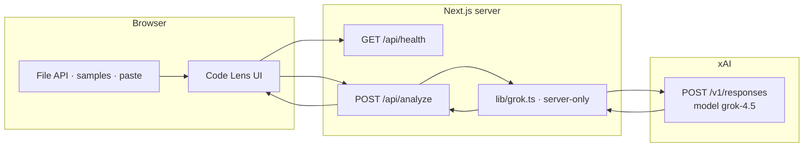

<div align="center">

```
        ╭──────────╮
     ╭──┤  ◉  CL  ├──╮
     │  ╰──────────╯  │
     │   code-lens    │
     ╰────────────────╯
```

# Code Lens

**Point the lens at your code.**  
Drop a file or folder — get explanations, bug fixes, unit tests, and refactors from **grok-4.5**.

[](https://nextjs.org/)
[](https://www.typescriptlang.org/)
[](https://docs.x.ai)
[](https://vitest.dev/)
[](#)

[Live idea](#one-minute-demo) · [Setup](#quick-start) · [Architecture](#architecture) · [Security](#security)

</div>

---

## What it is

Code Lens is a **local developer tool** with an optical-instrument UI. You bring the source; it runs **real** analysis through the [xAI Responses API](https://docs.x.ai) — no mocked panels, no canned demos.

| Lens | Output |
|:-----|:-------|
| **Explain** | Plain-English walkthrough of what the code does |
| **Fix Bugs** | Likely issues, rationale, corrected source + diff |
| **Generate Tests** | Unit tests in a fitting framework (Jest, pytest, …) |
| **Suggest Improvements** | Actionable refactors, quality, and performance tips |

Three built-in samples (JS off-by-one · Python empty-list · TS utility) make the app demoable in under a minute with zero uploads.

---

## Preview of the experience

```
┌─────────────────────────────────────────────────────────────────────────┐
│  ◉  code-lens · optical analyzer · grok-4.5              [cmd] [paste]  │
├──────────┬───────────────────────────────┬──────────────────────────────┤
│  files   │  sumRange.js            js    │  analysis          ● locked  │
│ ───────  │  ───────────────────────────  │  ──────────────────────────  │
│  ∗ all   │   1  function sumRange(…) {   │  quality spectrum      A  88 │
│  js      │   2    for (let i = …)        │  ──────────────────────────  │
│  py      │   3  }                        │  EXPLAIN                     │
│  ts      │                               │  Sums inclusive range…       │
│          │  [src] [fix]  find wrap copy  │  FIX BUGS                    │
│          │                               │  Off-by-one in loop…  [diff] │
└──────────┴───────────────────────────────┴──────────────────────────────┘
  FOCUS  samples/sumRange.js  javascript  ● locked        t+4.2s  grok-4.5
```

Three-pane shell: **files** · **source** · **analysis** — with keyboard-first controls and a phosphor “instrument” aesthetic.

---

## Quick start

### Requirements

- **Node.js 18+**
- An **xAI API key** from [console.x.ai](https://console.x.ai)

### Install

```bash
git clone https://github.com/himanshu-nakrani/code-lens.git
cd code-lens
npm install
```

### Configure the key

```bash
# Shell (recommended for a single session)
export XAI_API_KEY="xai-..."

# Or project-local (gitignored)
cp .env.example .env
# edit .env → XAI_API_KEY=xai-...
```

> The app **will not start** without a key. Preflight prints setup instructions and exits non-zero.

### Run

```bash
npm run dev
# → http://localhost:3000
```

---

## One-minute demo

1. Start the app with `XAI_API_KEY` set  
2. Open [http://localhost:3000](http://localhost:3000)  
3. Press **`1`** or click **focus + run** on the JS sample  
4. Watch the focusing orb → results lock on the right  

| Key | Action |
|:----|:-------|
| `⌘/Ctrl + Enter` | Run analysis |
| `⌘/Ctrl + K` | Command palette |
| `⌘/Ctrl + F` | Find in file |
| `⌘/Ctrl + ⇧ + P` | Paste code |
| `1` `2` `3` | Empty: run samples · Loaded: switch panes |
| `[` `]` | Previous / next file |

---

## Features

### Analysis
- **Four toggleable lenses** with presets (full · bugs · tests · quality)
- **Whole-workspace or single-file** focus
- **Apply fix** into the editor · **Add tests as a new file**
- **Diff view** of original vs fixed code
- **Export** results as Markdown or JSON · shareable summary

### Workspace
- Drag-and-drop **folder** or multi-file upload (`webkitdirectory`)
- **Paste** snippets without saving files first
- Client-side ingest only — caps, binary skip, clear skip reasons
- Session restore via `localStorage` (files + last result)

### Craft
- Optical UI: aperture logo, scan beam, focus HUD, lock burst
- Syntax-highlighted viewer and result blocks with copy / save
- Dark instrument palette (IBM Plex · phosphor accent)

---

## Architecture



| Path | Responsibility |
|:-----|:---------------|
| `src/components/*` | Client UI only — never imports the Grok helper |
| `src/app/api/analyze` | Validate body → call Grok → parse strict JSON |
| `src/app/api/health` | `{ ok, hasKey, model }` — no secrets |
| `src/lib/grok.ts` | `server-only` Responses API client |
| `src/lib/parse.ts` | Fence-tolerant JSON recovery |
| `src/lib/files.ts` | Browser ingest filters & size caps |

---

## Security

| Guarantee | How |
|:----------|:----|
| Key never reaches the browser | Read only from `process.env` on the server |
| Fail closed without a key | `scripts/check-api-key.js` + 503 on analyze |
| Safe error bodies | Secrets redacted before JSON responses |
| No mock analysis | Missing key / API failure → explicit error UI |
| Client boundary | Tests assert components never import `@/lib/grok` |

```bash
# Expected without a key
npm run dev
# → exits 1, points you to https://console.x.ai
```

---

## Upload safety

| Limit | Value |
|:------|:------|
| Per file | 200 KB |
| Total payload | 2 MB |
| Max files | 80 |
| Types | Text / source by extension + binary sniff |

Skipped and truncated files are reported in the UI — nothing is silently dropped without a reason.

---

## Scripts

| Command | Description |
|:--------|:------------|
| `npm run dev` | Key check → Next.js dev server |
| `npm run build` | Production build |
| `npm run start` | Key check → production server |
| `npm test` | Vitest unit tests (shipped modules) |
| `npm run lint` | ESLint |
| `npm run check-key` | Preflight only |

```bash
npm test          # parse · ingest · diff · validate · security
npm run build
npm run start
```

---

## Project layout

```
code-lens/
├── scripts/
│   └── check-api-key.js      # refuse start without XAI_API_KEY
├── src/
│   ├── app/
│   │   ├── api/
│   │   │   ├── analyze/      # POST analysis
│   │   │   └── health/       # GET readiness
│   │   ├── globals.css       # instrument design system
│   │   └── page.tsx
│   ├── components/           # three-pane UI, samples, results
│   └── lib/
│       ├── grok.ts           # server-only xAI client
│       ├── parse.ts          # robust model JSON parse
│       ├── files.ts          # File API ingest
│       └── *.test.ts         # Vitest suites
├── .env.example
└── package.json
```

---

## Stack

| Layer | Choice |
|:------|:-------|
| Framework | Next.js 16 (App Router) |
| Language | TypeScript |
| Styling | Tailwind CSS 4 + custom tokens |
| Highlighting | Prism (`react-syntax-highlighter`) |
| Model | xAI Responses API · `grok-4.5` |
| Tests | Vitest |

---

## License

Private project. All rights reserved unless otherwise noted.

---

<div align="center">

**Code Lens** · built for local demos that feel production-real  
Requires a key from [console.x.ai](https://console.x.ai)

</div>
