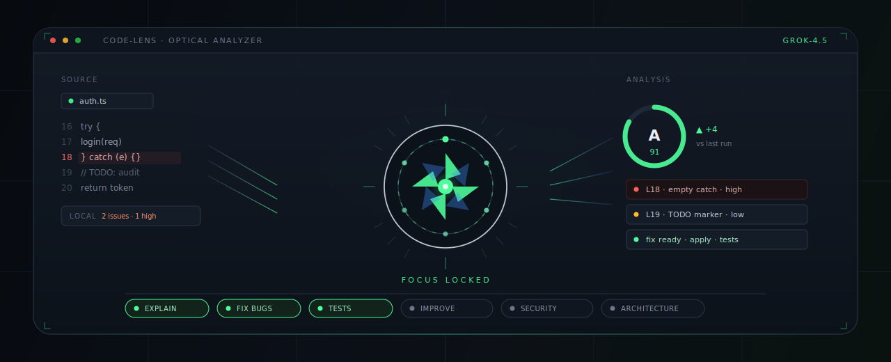
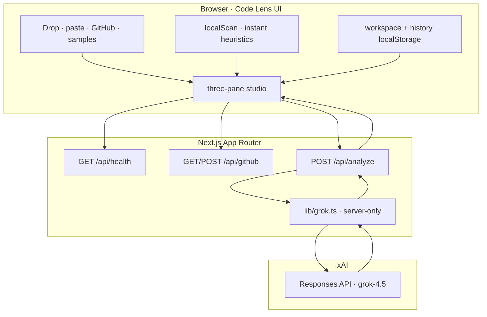
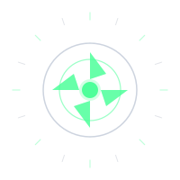

<div align="center">

<!-- Optical instrument header: source → aperture → analysis -->


# Code Lens

### An optical instrument for source code

**Point the lens. Lock focus. Read the signal.**  
Drop a file, paste a snippet, or pull a GitHub tree — **grok-4.5** runs multi-lens analysis with structured findings, fixes, tests, and a live quality scorecard.

<br/>

[](https://nextjs.org/)
[](https://www.typescriptlang.org/)
[](https://docs.x.ai)
[](https://vitest.dev/)
[](#license)

<br/>

[`Quick start`](#-quick-start)
&nbsp;·&nbsp;
[`Lenses`](#-six-lenses)
&nbsp;·&nbsp;
[`Studio`](#-the-studio)
&nbsp;·&nbsp;
[`Architecture`](#-architecture)
&nbsp;·&nbsp;
[`Security`](#-security)

</div>

---

## Why Code Lens

Most AI code tools feel like chat bolted onto a textarea.  
Code Lens is built like a **lab instrument** — three panes, phosphor accents, keyboard-first focus, and analysis that lands as **structured findings** you can jump to, apply, undo, and export.

```
  before                          after
  ─────                           ─────
  "explain this file"             quality A · 88  ▲+6
  wall of prose                   L12  empty catch · high
  hope the model is right         apply fix · add tests · SARIF
```

<div align="center">

| Instant | Intelligent | Ownable |
|:-------:|:-----------:|:-------:|
| Local static scan before the API | Six grok-4.5 lenses | Diff · apply · undo · export |
| No wait for TODOs / empty catch / `eval` | Explain · bugs · tests · security · architecture | Markdown · JSON · SARIF |

</div>

---

## Preview

```
┌─ code-lens · optical analyzer · grok-4.5 ────────────────── ⌘K · paste · github ─┐
│                                                                                   │
│  files          │  src/auth.ts · javascript · edit              │  analysis       │
│  ─────────────  │  ───────────────────────────────────────────  │  ─────────────  │
│  ∗ workspace    │  local · 2 issues · 1 high · L18 empty catch  │  score  A  91   │
│  auth.ts   ●    │                                               │       ▲ +4      │
│  db.js          │   16  try {                                   │  ─────────────  │
│  tests/         │   17    login(req)                            │  ◎ explain      │
│                 │   18  } catch (e) {}   ◂ high                 │  ◎ fix bugs     │
│  recent         │   19                                          │  ◎ security     │
│  ▸ 2 · B · 4f   │  [src] [fix]  find  wrap  copy  edit           │  next steps ▢▢  │
│                 │                                               │  export · share │
└─────────────────┴───────────────────────────────────────────────┴─────────────────┘
  files 3 · 12.4 KB · javascript · 48L · local 2 · t+3.8s · grok-4.5
```

**Glass Sapphire** (dark) and **Paper Glacier** (light) themes · resizable panes · session restore.

---

## Six lenses

Toggle any combination. Run **standard** or **deep**. Optional focus note steers the model without swapping lenses.

| Lens | What locks into focus |
|:-----|:----------------------|
| **Explain** | Plain-English walkthrough of intent and control flow |
| **Fix Bugs** | Structured issues, rationale, corrected source + side-by-side diff |
| **Generate Tests** | Framework-fit suite (Jest, pytest, …) + coverage notes |
| **Improvements** | Actionable refactors for quality, clarity, performance |
| **Security** | Risk level, CWE-aware findings, prioritized remediations |
| **Architecture** | Coupling / cohesion, hotspots, structural recommendations |

Built-in samples (JS off-by-one · Python empty-list · TS utility) make the app demoable in **under a minute** with zero uploads.

---

## The studio

### Instant signal
- **Local static scan** — TODOs, empty catches, `eval`, secret-ish patterns, and more, *before* the model returns
- Gutter annotations + findings nav (`n` / `p`) for lined issues
- Live **scorecard** with multi-axis quality and **score deltas** across runs

### Workspace
- Drag-and-drop **folder** or multi-file upload
- **Paste** snippets · **GitHub repo** import
- Single-file or whole-workspace focus
- **Edit source** in-pane · apply fix · add tests as a new file · **undo**
- File tree actions: select · remove · analyze one file
- Session + analysis history in `localStorage` (restored on reload)

### Instrument chrome
- Command palette · keyboard map · focus mode
- Resizable files / results panes (widths remembered)
- Diff view · next-steps checklist · share summary
- Export **Markdown**, **JSON**, **SARIF**

---

## Quick start

### Requirements

- **Node.js 18+**
- An **xAI API key** from [console.x.ai](https://console.x.ai)

### Install

```bash
git clone https://github.com/himanshu-nakrani/code-lens.git
cd code-lens
npm install
```

### Configure

```bash
# Session
export XAI_API_KEY="xai-..."

# Or project-local (gitignored)
cp .env.example .env
# → XAI_API_KEY=xai-...
```

> The app **refuses to start** without a key. Preflight prints setup instructions and exits non-zero.

### Run

```bash
npm run dev
# → http://localhost:3000
```

### One-minute demo

1. Open the app with `XAI_API_KEY` set  
2. Press **`1`** (or click the JS sample)  
3. Watch local scan → focusing → results lock  
4. Jump to a lined finding · apply fix · undo  

---

## Keyboard

| Key | Action |
|:----|:-------|
| `⌘/Ctrl` + `Enter` | Run analysis |
| `⌘/Ctrl` + `K` | Command palette |
| `⌘/Ctrl` + `F` | Find in file |
| `⌘/Ctrl` + `S` | Save current file |
| `⌘/Ctrl` + `⇧` + `P` | Paste code |
| `⌘/Ctrl` + `⇧` + `G` | GitHub import |
| `1` `2` `3` | Empty: load samples · Loaded: switch panes |
| `[` `]` | Previous / next file |
| `n` / `p` | Next / previous lined finding |
| `?` | Shortcuts |

---

## Architecture



| Path | Responsibility |
|:-----|:---------------|
| `src/components/*` | Client UI only — never imports the Grok helper |
| `src/app/api/analyze` | Validate → call model → parse strict JSON |
| `src/app/api/github` | Repo tree fetch for import |
| `src/app/api/health` | `{ ok, hasKey, model }` — no secrets |
| `src/lib/grok.ts` | `server-only` xAI Responses client |
| `src/lib/local-scan.ts` | Pure client heuristics (unit-tested) |
| `src/lib/parse.ts` | Fence-tolerant JSON recovery |
| `src/lib/history-store.ts` | Slim persisted analysis history |
| `src/lib/files.ts` | Browser ingest filters & size caps |

---

## Security

| Guarantee | How |
|:----------|:----|
| Key never reaches the browser | Read only from `process.env` on the server |
| Fail closed without a key | `scripts/check-api-key.js` + 503 on analyze |
| Safe error bodies | Secrets redacted before JSON responses |
| No mock analysis | Missing key / API failure → explicit error UI |
| Client boundary | Tests assert components never import `@/lib/grok` |

```bash
# Expected without a key
npm run dev
# → exits 1, points you to https://console.x.ai
```

### Upload safety

| Limit | Value |
|:------|:------|
| Per file | 200 KB |
| Total payload | 2 MB |
| Max files | 80 |
| Types | Text / source by extension + binary sniff |

Skipped and truncated files are reported in the UI — nothing is silently dropped without a reason.

---

## Scripts

| Command | Description |
|:--------|:------------|
| `npm run dev` | Key check → Next.js dev server |
| `npm run build` | Production build |
| `npm run start` | Key check → production server |
| `npm test` | Vitest (parse · ingest · local scan · history · security · …) |
| `npm run lint` | ESLint |
| `npm run check-key` | Preflight only |

```bash
npm test
npm run build
npm run start
```

---

## Project layout

```
code-lens/
├── scripts/
│   └── check-api-key.js       # refuse start without XAI_API_KEY
├── src/
│   ├── app/
│   │   ├── api/
│   │   │   ├── analyze/       # POST multi-lens analysis
│   │   │   ├── github/        # repo import
│   │   │   └── health/        # readiness (no secrets)
│   │   ├── globals.css        # Glass Sapphire · Paper Glacier
│   │   └── page.tsx
│   ├── components/            # studio UI · scorecard · scan · resize
│   └── lib/
│       ├── grok.ts            # server-only xAI client
│       ├── local-scan.ts      # instant heuristics
│       ├── parse.ts           # robust model JSON parse
│       ├── history-store.ts   # persisted run history
│       ├── files.ts           # File API ingest
│       └── *.test.ts
├── .env.example
└── package.json
```

---

## Stack

| Layer | Choice |
|:------|:-------|
| Framework | Next.js 16 · App Router |
| Language | TypeScript · React 19 |
| Styling | Tailwind CSS 4 + design tokens |
| Highlighting | Prism (`react-syntax-highlighter`) |
| Model | xAI Responses API · **grok-4.5** |
| Tests | Vitest |

---

## License

Private project. All rights reserved unless otherwise noted.

---

<div align="center">



<br/>

**Code Lens** — built for demos that feel production-real  
Get a key at [console.x.ai](https://console.x.ai) · clone · `export XAI_API_KEY` · `npm run dev`

<br/>

<sub>Not affiliated with xAI. Requires your own API key.</sub>

</div>
